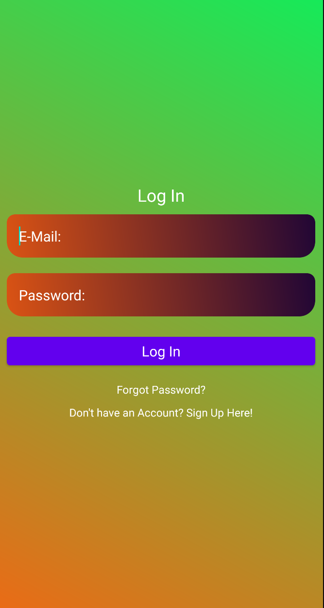
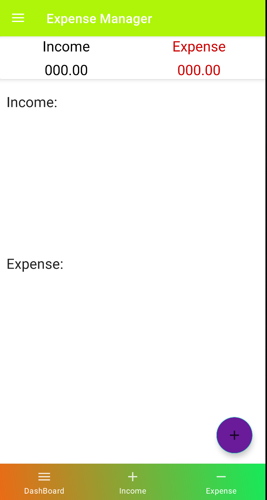
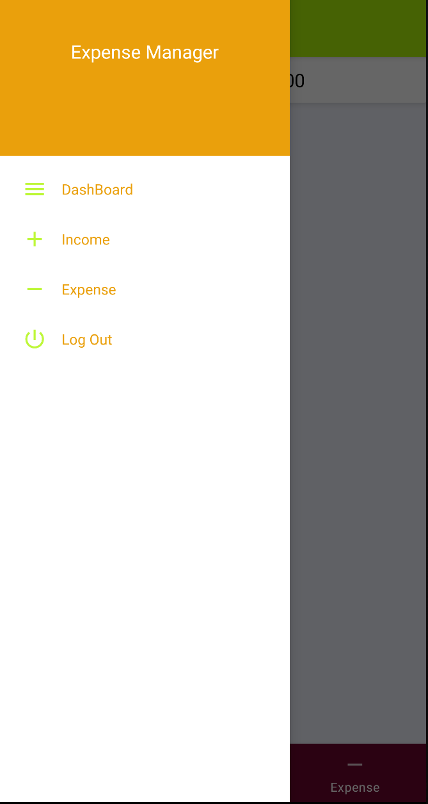
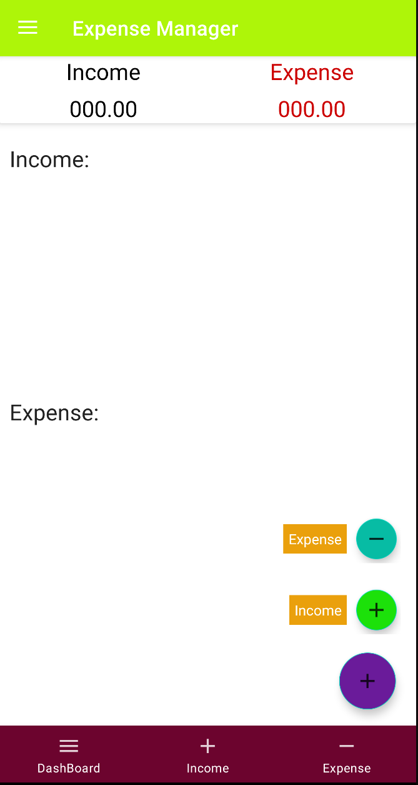
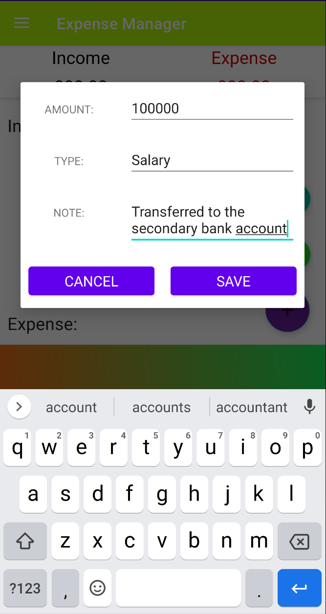
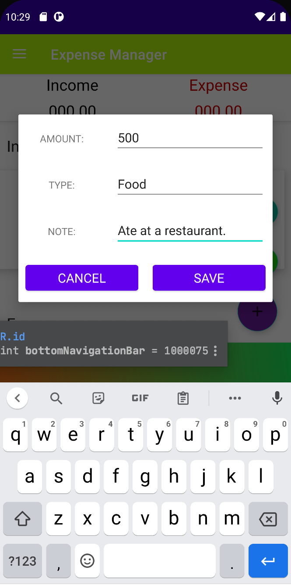

# Expense-Manager-Application
An Android application that enables the user to manage his/her day to day expenses.

## User Log In Screen

## Home Screen Displayed After Successful Log In

## Side Bar

## Buttons to add Income/Expenses

## Adding Income

## Adding Expense

